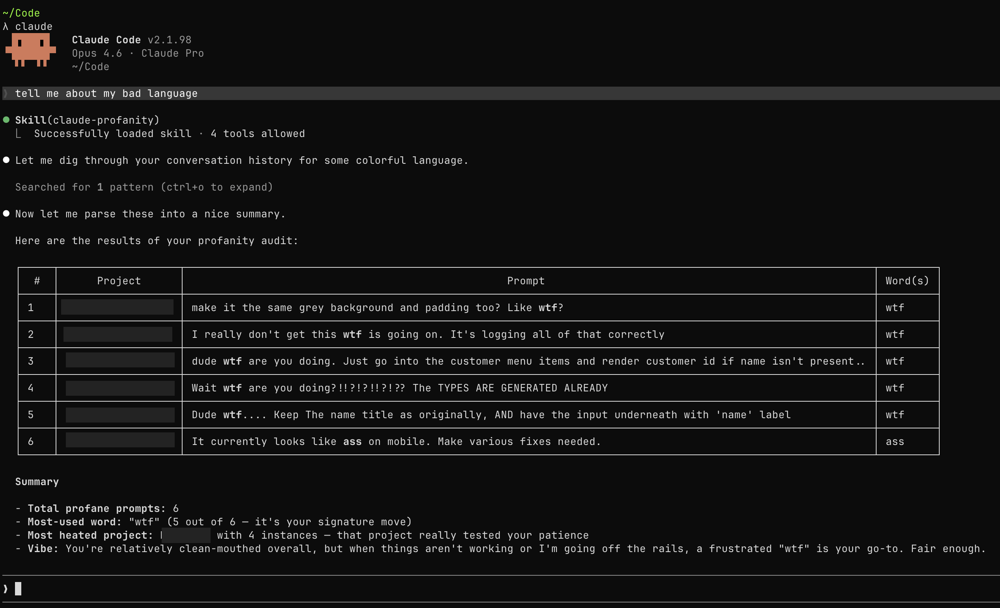

# Claude Profanity Skill

Search through Claude Code conversation history for prompts containing profanity. Use when the user wants to find or audit profanity in their past Claude conversations.

This skill follows the [Agent Skills specification](https://agentskills.io/specification) but is currently only compatible with [Claude Code](https://docs.anthropic.com/en/docs/claude-code).

## Install

```sh
gh skill install oliverbenns/claude-profanity claude-profanity
```

## Usage

Ask Claude Code to check your conversation history for profanity. The skill will search `~/.claude/history.jsonl` and present results in a table.



## Publishing

Publishing is handled manually via `gh skill publish`.
